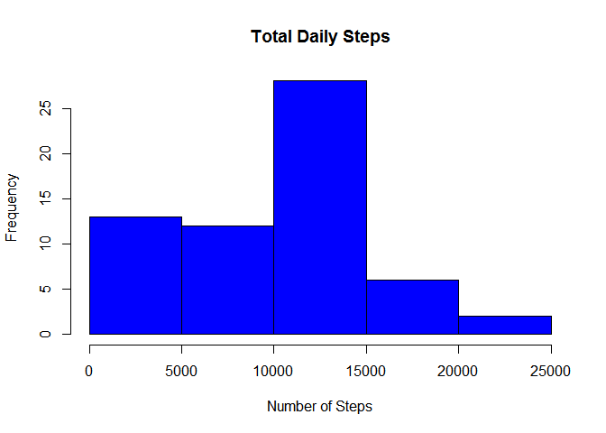
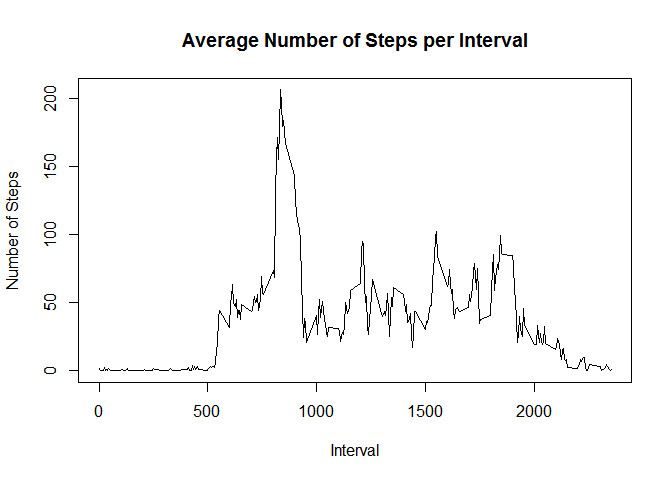
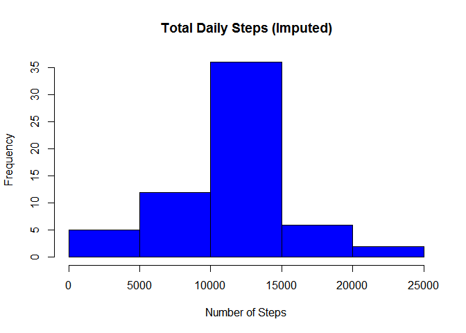

# Assignment: Course Project 1
Neil  
11 January 2016  


#Reproducible Research Project 1
##Loading and preprocessing the data

In the below code, I shall be reading in the un-zipped data from the working directory into a dataset called "activity":


```r
activity<-read.csv(file="activity.csv")
activity$date<-as.Date(activity$date)
```


##What is mean total number of steps taken per day?
###Calculate the total steps per day (ignoring 'NA' values):

I shall use the 'aggregate' function to find the total steps per day:


```r
aggdata <-aggregate(activity$steps, by=list(activity$date), FUN=sum, na.rm=TRUE)
```

###Make a histogram of the total number of steps taken each day:


```r
hist(aggdata$x, main = paste("Total Daily Steps"), col="blue", xlab="Number of Steps")
```

 

The mean daily steps is:

```r
mean(aggdata$x)
```

```
## [1] 9354.23
```


The median daily steps is: 

```r
median(aggdata$x)
```

```
## [1] 10395
```
 
  
  
##What is the average daily activity pattern?

###Make a time series plot of the 5-minute interval (x-axis) and the average number of steps taken, averaged across all days (y-axis):


```r
int_steps <- aggregate(steps ~ interval, activity, mean)

plot(int_steps$interval,int_steps$steps, type="l", xlab="Interval", ylab="Number of Steps",main="Average Number of Steps per Interval")
```

 

###Which 5-minute interval, on average across all the days in the dataset, contains the maximum number of steps?


```r
sort_steps<-int_steps[order(-int_steps$steps),]
sort_steps[1,]
```

```
##     interval    steps
## 104      835 206.1698
```

The 5-minute interval with the greatest number of average steps is interval #835, with a an average of 206 steps.


##Imputing missing values

###Calculate and report the total number of missing values in the dataset

Subset the data to only the rows with missing values and then count the number of rows of the new dataset:


```r
NA.rows<-activity[activity$steps=="NA",]
nrow(NA.rows)
```

```
## [1] 2304
```

The number of missing values is: 2304.


###Devise a strategy for filling in all of the missing values in the dataset. 

I will impute the missing values by assigning the average number of steps for each interval into those intervals with NA's. 

###Create a new dataset that is equal to the original dataset but with the missing data filled in.


```r
imp_activity <- transform(activity, steps = ifelse(is.na(activity$steps), int_steps$steps[match(activity$interval, int_steps$interval)], activity$steps))
```

###Create a new histogram and find the mean and median of the imputed data.

I will use similar code as before:


```r
imp_aggdata <-aggregate(imp_activity$steps, by=list(imp_activity$date), FUN=sum)
hist(imp_aggdata$x, main = paste("Total Daily Steps (Imputed)"), col="blue", xlab="Number of Steps")
```

 

The mean daily steps of the imputed data is:

```r
mean(imp_aggdata$x)
```

```
## [1] 10766.19
```


The median daily steps of the imputed data is: 

```r
median(imp_aggdata$x)
```

```
## [1] 10766.19
```
 
Comparing the original and imputed values:

Data          | Mean          | Median        |
------------- | ------------- | ------------- |  
Original      | 9354.23       | 10395         |
Imputed       | 10766.19      | 10766.19      |
------------- | ------------- | ------------- |  
Difference    | -1411.959     | -371.1887     |


As you can see, there is a very large impact by using imputed values.  This is due to the lerge number of missing data in the original dataset.
  
   
   
##Are there differences in activity patterns between weekdays and weekends?

###Create a new factor variable in the dataset with two levels

The new factor variable is created below using a 'for loop':


```r
for (i in 1:nrow(imp_activity)) {
    if (weekdays(imp_activity$date[i]) == "Saturday" | weekdays(imp_activity$date[i]) == "Sunday") {
        imp_activity$day_ind[i] = "Weekend"
    } else {
        imp_activity$day_ind[i] = "Weekday"
    }
}
imp_activity$day_ind<-as.factor(imp_activity$day_ind)
```

###Make a panel plot containing a time series plot of the 5-minute interval (x-axis) and the average number of steps taken, averaged across all weekday days or weekend days (y-axis).

Recalculating the averages, taking into account the weekend/weekday status:


```r
wd_aggdata <- aggregate(steps ~ interval + day_ind, imp_activity, mean)
```

And now, I shall generate the panel/lattice plot below:


```r
library(lattice)
xyplot(wd_aggdata$steps ~ wd_aggdata$interval|wd_aggdata$day_ind, main="Average Steps per Day by Interval",xlab="Interval", ylab="Steps",layout=c(1,2), type="l")
```

 

From inspection, there is a large difference in activity patterns between weekdays and weekends.
